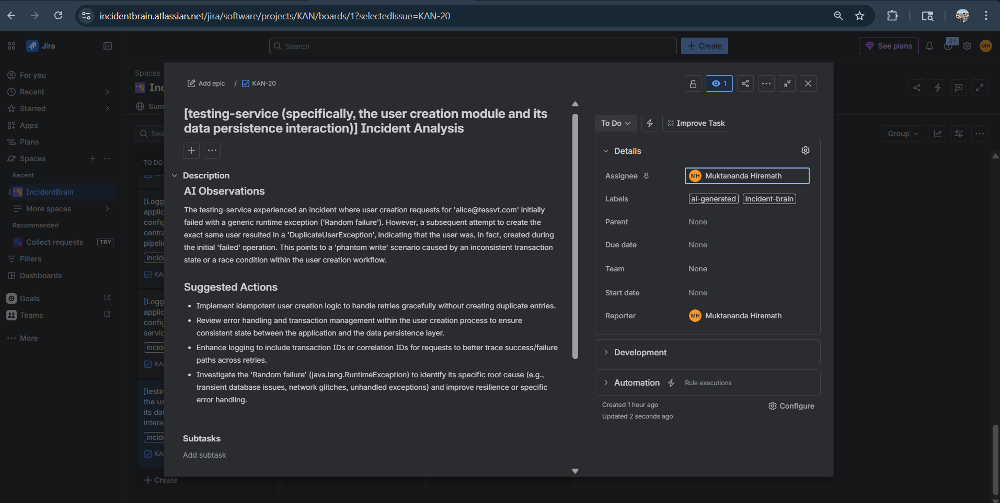
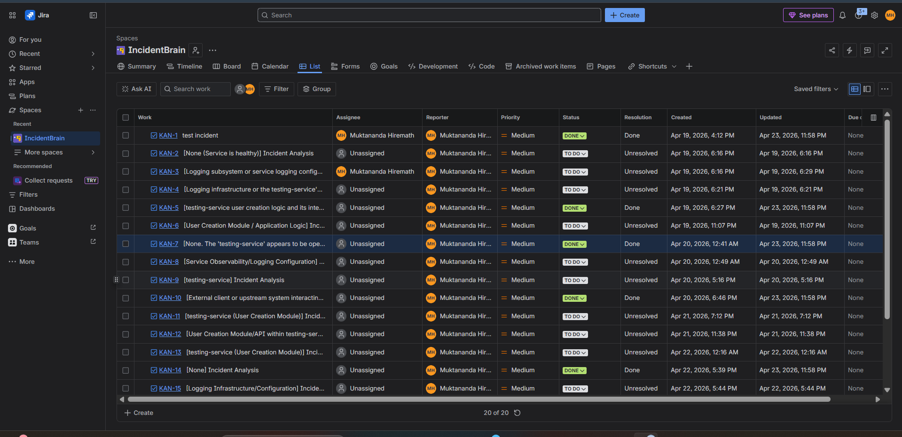

# Event-Driven Incident Detection & LLM-Assisted Jira Auto-Ticketing System

AI-powered incident management platform built on Spring Boot microservices. IncidentBrain automatically ingests Prometheus alerts, correlates them into incidents, enriches each incident with logs and deployment context, generates root cause analysis using an LLM, creates Jira tickets, and produces structured postmortems — all in real time through an event-driven Kafka pipeline.

### Overview

Modern engineering teams deal with a flood of alerts during incidents. Triaging, correlating, and writing postmortems is slow, manual, and error-prone. IncidentBrain solves this by building a fully automated pipeline:

1. The Alert Service scrapes Prometheus endpoints and publishes raw alerts to Kafka when latency thresholds are breached.
2. The Correlation Service groups related alerts into incidents using a sliding time window.
3. The Context Service enriches each incident with logs from Elasticsearch and health data from Spring Actuator endpoints.
The AI Service performs root cause analysis using an LLM, generating structured insights and remediation suggestions, with results cached in Redis for faster subsequent responses.
5. The Jira Service automatically creates and links tickets from the AI analysis output.

All Spring Boot services register with Eureka and are reached through the API Gateway. The entire stack runs locally via Docker Compose.

---

### System Design

---

### Project Structure

### Technology Stack

| Layer | Technology | Purpose |
|---|---|---|
| Service Registry | Spring Cloud Netflix Eureka | Service discovery and health monitoring |
| API Gateway | Spring Cloud Gateway | Single entry point, routing, load balancing |
| Microservices | Spring Boot 3, Java 17 | Alert, Correlation, Context, Copilot, Postmortem, Jira |
| Event Streaming | Apache Kafka | Async event pipeline between services |
| AI Engine | Spring AI | LLM inference, prompt orchestration, response generation |
| LLM | Gemini 2.5 flash | Root cause analysis and natural language generation |
| Relational DB | PostgreSQL | Persistent storage for incidents and postmortems |
| Search and Logs | Elasticsearch | Log indexing and full-text search |
| Cache | Redis | AI response caching and session data |
| Metrics | Prometheus | Alert scraping and latency threshold monitoring |
| Issue Tracking | Jira | Automated ticket creation from AI analysis |
| Frontend | React, Next.js | Dashboard and Copilot chat interface |
| Containerization | Docker, Docker Compose | Local orchestration of all services |

---

### Topic Reference & Lifecycle

| Topic / Queue | Producer | Consumer(s) | Key Fields | Purpose |
|:---|:---|:---|:---|:---|
| `alerts.raw` | Alert Service | Correlation Service | `alertId`, `service`, `severity`, `message` | Ingests raw telemetry and system alerts. |
| **`alerts.raw.dlq`** | Correlation Service | *Manual/Admin* | `originalPayload`, `errorReason` | **DLQ:** Captures raw alerts that fail parsing or correlation logic. |
| `incidents.created` | Correlation Service | Context Service | `incidentId`, `alerts[]`, `affectedService` | Aggregated events identified as a single incident. |
| **`incidents.created.dlq`** | Context Service | *Manual/Admin* | `incidentId`, `errorDetails` | **DLQ:** Holds incidents where context gathering (logs/metrics) failed. |
| `context.ready` | Context Service | AI Service, Postmortem Service | `incidentId`, `logs[]`, `metrics`, `traceId` | Fully enriched data ready for LLM analysis. |
| **`context.failed.dlq`** | AI Service | *Manual/Admin* | `incidentId`, `missingContext` | **DLQ:** Triggers if AI Service receives incomplete or corrupted context data. |
| `analysis.completed` | AI Service | Jira Service, Notification Service | `incidentId`, `rootCause`, `remediations[]` | AI-generated summary and suggested fixes. |
| **`analysis.completed.dlq`** | Jira Service | *Manual/Admin* | `incidentId`, `analysisResult` | **DLQ:** Stores results if the Jira API is unreachable or rate-limited. |

### Resiliency & Fault Tolerance

1.  **Fault Tolerance (Resilience4j):**
    * **Circuit Breakers:** Implemented within the API Gateway and downstream services to prevent cascading failures.
    * **Rate Limiting:** Integrated into the Jira Service (backed by Redis) to stay within API quotas and prevent "alert storms" from flooding the dashboard.

2.  **Security:**
    * **End-to-End Encryption:** Sensitive incident data is encrypted using AES-256 before being published to Kafka.
    * **Spring Security Filter Chain:** Protects all ingest and configuration endpoints within the private network.

### Reference Ticket

### Scalability Roadmap
### Advanced Intelligence & Scalability Roadmap

### 1. RAG-Powered Historical Context (Similarity Search)
To move beyond basic pattern matching, IncidentBrain implements **Retrieval-Augmented Generation (RAG)**. This allows the AI to "remember" how similar incidents were solved in the past.

* **Mechanism:** When a new incident is identified, the **Context-service** generates a vector embedding of the current logs and metrics.
* **Vector Search:** It queries a **pgvector-enabled PostgreSQL** instance to find the top 3-5 most similar historical incidents.
* **Result:** The LLM receives the current error *and* the successful remediation steps from the past, significantly improving the accuracy of the suggested fix.

### 2. Distributed Tracing & Observability
We leverage **OpenTelemetry (OTel)** and **Jaeger** to maintain a unified view across our event-driven microservices.

* **Correlation IDs:** Every event across Kafka carries a global `traceId`.
* **Bottleneck Detection:** Distributed tracing allows us to visualize the latency between the `Alert-service` and the `Jira-service`, ensuring the event bus doesn't become a bottleneck.
* **Log Aggregation:** Links specific Kafka offsets to high-level system metrics for a 360-degree view of system health.

### 3. Proposed "Smart" Features
* **Auto-Remediation (Self-Healing):** A "Remediation-service" that can execute pre-approved scripts (e.g., restarting a pod or clearing a cache) if the LLM's confidence score is above 95%.
* **Sentiment Analysis for Alerts:** Prioritizing incidents based on the "panic level" of downstream service errors or user feedback.
* **Predictive Incident Detection:** Using historical data to predict potential failures (e.g., disk space exhaustion) before they trigger a raw alert.

---
### Professional Network

  
  &nbsp;&nbsp;&nbsp;&nbsp;
  
  &nbsp;&nbsp;&nbsp;&nbsp;
  
  &nbsp;&nbsp;&nbsp;&nbsp;
  

