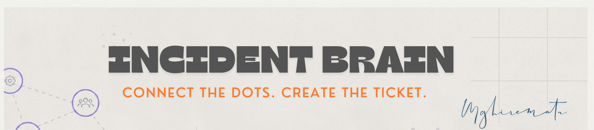
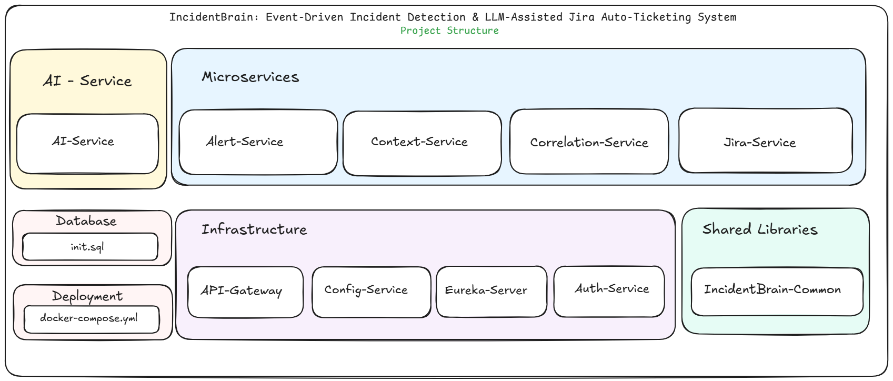

# IncidentBrain: Event-Driven Incident Detection & LLM-Assisted Jira Auto-Ticketing System

AI-powered incident management platform built on Spring Boot microservices. IncidentBrain automatically ingests Prometheus alerts, correlates them into incidents, enriches each incident with logs and deployment context, generates root cause analysis using an LLM, creates Jira tickets, and produces structured postmortems — all in real time through an event-driven Kafka pipeline.


## Overview

Modern engineering teams deal with a flood of alerts during incidents. Triaging, correlating, and writing postmortems is slow, manual, and error-prone. IncidentBrain solves this by building a fully automated pipeline:

1. The Alert Service scrapes Prometheus endpoints and publishes raw alerts to Kafka when latency thresholds are breached.
2. The Correlation Service groups related alerts into incidents using a sliding time window.
3. The Context Service enriches each incident with logs from Elasticsearch and health data from Spring Actuator endpoints.
The AI Service performs root cause analysis using an LLM, generating structured insights and remediation suggestions, with results cached in Redis for faster subsequent responses.
5. The Jira Service automatically creates and links tickets from the AI analysis output.

All Spring Boot services register with Eureka and are reached through the API Gateway. The entire stack runs locally via Docker Compose.

---

## System Design


---

## Project Structure



## Technology Stack

| Layer | Technology | Purpose |
|---|---|---|
| Service Registry | Spring Cloud Netflix Eureka | Service discovery and health monitoring |
| API Gateway | Spring Cloud Gateway | Single entry point, routing, load balancing |
| Microservices | Spring Boot 3, Java 17 | Alert, Correlation, Context, Copilot, Postmortem, Jira |
| Event Streaming | Apache Kafka | Async event pipeline between services |
| AI Engine | Spring AI | LLM inference, prompt orchestration, response generation |
| LLM | Gemini 2.5 flash | Root cause analysis and natural language generation |
| Relational DB | PostgreSQL | Persistent storage for incidents and postmortems |
| Search and Logs | Elasticsearch | Log indexing and full-text search |
| Cache | Redis | AI response caching and session data |
| Metrics | Prometheus | Alert scraping and latency threshold monitoring |
| Issue Tracking | Jira | Automated ticket creation from AI analysis |
| Frontend | React, Next.js | Dashboard and Copilot chat interface |
| Containerization | Docker, Docker Compose | Local orchestration of all services |

---


### Topic Reference

| Topic | Producer | Consumer(s) | Key Fields |
|---|---|---|---|
| `alerts.raw` | Alert Service | Correlation Service | alertId, service, severity, timestamp, message |
| `incidents.created` | Correlation Service | Context Service | incidentId, alerts[], startTime, affectedService |
| `context.ready` | Context Service | AI Service, Postmortem Service | incidentId, logs[], metrics, deploymentInfo |
| `analysis.completed` | AI Service | Jira Service, Notification Service | incidentId, rootCause, remediations[], summary |

---

## Getting Started

### Prerequisites

- Java 17 or higher
- Maven 3.8 or higher
- React.js 18 or higher
- Docker and Docker Compose

### 1. Clone the repository

```bash
git clone https://github.com/MGhiremath0281/IncidentBrain.git
cd IncidentBrain
```

### 2. Start infrastructure with Docker Compose

```bash
docker-compose up -d kafka zookeeper postgres redis elasticsearch weaviate
```

Wait for all containers to report healthy before proceeding.

### 3. Start the Eureka Server

```bash
cd eureka-server
mvn spring-boot:run
```

Verify the registry is running at `http://localhost:8761`.

### 4. Start the API Gateway

```bash
cd api-gateway
mvn spring-boot:run
```

### 5. Start each Spring Boot microservice

Run each of the following in a separate terminal:

```bash
cd alert-service && mvn spring-boot:run
cd correlation-service && mvn spring-boot:run
cd context-service && mvn spring-boot:run
cd ai-service && mvn spring-boot:run
cd jira-service && mvn spring-boot:run
```

Verify all services appear in the Eureka dashboard at `http://localhost:8761`.

### 7. Start the Frontend

```bash
cd incidentbrain-ui
npm install
npm run dev
```

The UI is accessible at `http://localhost:3000`.

---

## Initial Configuration

Before the pipeline processes any alerts, three configuration endpoints must be called. These configure where the system scrapes metrics, where it fetches logs, and where it creates Jira tickets.

### Step 1 — Register a Prometheus scrape target

This tells the Alert Service which Prometheus endpoint to monitor, under what name, and what latency threshold triggers an alert.

```
POST http://localhost:8080/ingest/subscribe?url=http://localhost:8084/actuator/prometheus&name=testing-service&threshold=0.002
```

| Parameter | Description |
|---|---|
| `url` | Full URL of the Prometheus `/actuator/prometheus` endpoint to scrape |
| `name` | Logical name used to group alerts and incidents for this service |
| `threshold` | Latency threshold in seconds — breaches above this value trigger an alert |

### Step 2 — Configure Elasticsearch and Actuator endpoints

This tells the Context Service where to fetch logs for enrichment and which Actuator base URL to use for health and metric data.

```
POST http://localhost:8080/api/config/endpoints
Content-Type: application/json

{
  "esUrl": "http://localhost:9200/incidentbrain-logs-*/_search",
  "metricsTemplate": "http://localhost:8084/actuator"
}
```

| Field | Description |
|---|---|
| `esUrl` | Elasticsearch query URL — can use a wildcard index pattern |
| `metricsTemplate` | Base Actuator URL — the Context Service appends paths such as `/health`, `/metrics`, and `/info` |

### Step 3 — Configure Jira credentials

This tells the Jira Service where and how to create tickets. Credentials are accepted at runtime and never stored in source code.

```
POST http://localhost:8080/api/config/jira
Content-Type: application/json

{
  "baseUrl": "https://your-org.atlassian.net",
  "userEmail": "you@example.com",
  "apiToken": "your-jira-api-token",
  "projectKey": "IB"
}
```

| Field | Description |
|---|---|
| `baseUrl` | Your Atlassian instance URL |
| `userEmail` | Email address associated with the API token |
| `apiToken` | Jira API token generated from your Atlassian account settings |
| `projectKey` | Jira project key under which issues will be created |

Once all three steps are complete, the pipeline is active. Any latency breach on the registered Prometheus endpoint will propagate through the full event chain: alert → incident → context → AI analysis → Jira ticket → postmortem.

---

## Configuration Reference

### Eureka Server — `application.yml`

```yaml
server:
  port: 8761

spring:
  application:
    name: eureka-server

eureka:
  client:
    register-with-eureka: false
    fetch-registry: false
  server:
    wait-time-in-ms-when-sync-empty: 0
```

### Eureka Client (all microservices)

```yaml
eureka:
  client:
    service-url:
      defaultZone: http://localhost:8761/eureka/
  instance:
    prefer-ip-address: true
```

### API Gateway — routes

```yaml
spring:
  cloud:
    gateway:
      discovery:
        locator:
          enabled: true
          lower-case-service-id: true
      routes:
        - id: alert-service
          uri: lb://alert-service
          predicates:
            - Path=/alerts/**,/ingest/**
        - id: copilot-service
          uri: lb://copilot-service
          predicates:
            - Path=/copilot/**
        - id: postmortem-service
          uri: lb://postmortem-service
          predicates:
            - Path=/postmortems/**
        - id: context-service
          uri: lb://context-service
          predicates:
            - Path=/api/config/endpoints
        - id: jira-service
          uri: lb://jira-service
          predicates:
            - Path=/api/config/jira
```

### Kafka — producer and consumer

```yaml
spring:
  kafka:
    bootstrap-servers: localhost:9092
    producer:
      key-serializer: org.apache.kafka.common.serialization.StringSerializer
      value-serializer: org.springframework.kafka.support.serializer.JsonSerializer
    consumer:
      group-id: incidentbrain-group
      auto-offset-reset: earliest
      key-deserializer: org.apache.kafka.common.serialization.StringDeserializer
      value-deserializer: org.springframework.kafka.support.serializer.JsonDeserializer
      properties:
        spring.json.trusted.packages: "*"
```

### Service Port Reference

| Service | Port | application.name |
|---|---|---|
| Eureka Server | 8761 | eureka-server |
| API Gateway | 8080 | api-gateway |
| Alert Service | 8081 | alert-service |
| Correlation Service | 8082 | correlation-service |
| Context Service | 8083 | context-service |

| Jira Service | 8089 | jira-service |
| AI Service | 8090 | — Spring Ai |
| Frontend UI | 3000 | — |

---

## API Reference

### Alert Service

```
POST   /ingest/subscribe     Register a Prometheus scrape target with name and threshold
GET    /alerts               List all alerts
GET    /alerts/{id}          Get alert by ID
```

Query parameters for `POST /ingest/subscribe`:

| Parameter | Type | Description |
|---|---|---|
| `url` | string | Prometheus endpoint URL |
| `name` | string | Logical service name |
| `threshold` | double | Latency threshold in seconds |

### Context Service

```
POST   /api/config/endpoints     Configure Elasticsearch URL and Actuator base URL
```

Request body:

```json
{
  "esUrl": "string",
  "metricsTemplate": "string"
}
```

### Copilot Service

```
POST   /copilot/query       Submit a question about an incident
WS     /copilot/ws          WebSocket endpoint for streaming chat
```
### Jira Service

```
POST   /api/config/jira     Configure Jira credentials and project
```

Request body:

```json
{
  "baseUrl": "string",
  "userEmail": "string",
  "apiToken": "string",
  "projectKey": "string"
}
```

### AI Service (internal)

```
POST   /analyze     Accepts enriched context payload, returns AI root cause analysis
```
---

## Contributing

Contributions are welcome. To contribute:

1. Fork the repository
2. Create a feature branch: `git checkout -b feature/your-feature-name`
3. Commit your changes: `git commit -m "feat: description of change"`
4. Push to your branch: `git push origin feature/your-feature-name`
5. Open a pull request against `main`

Please follow the existing code style. Each service is independently buildable and testable. Keep cross-service changes minimal and document any new Kafka topic contracts in this README.

---

## License

This project is licensed under the MIT License. See the [LICENSE](LICENSE) file for details.
